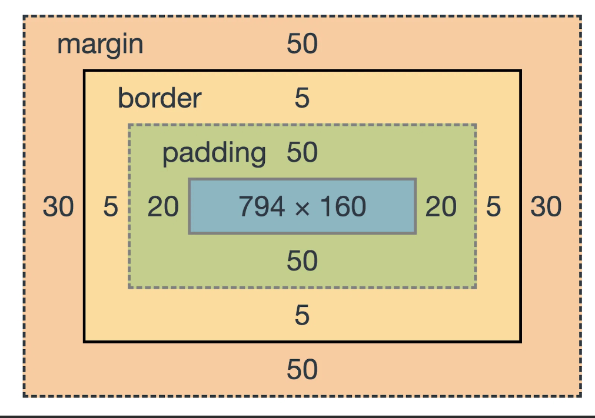

# Phase 2: Mobile First CSS

## Mobile First

"Mobile first" is the simplest strategy for designing responsive web page.

1. Start with no media queries at all: Define all the styles for the mobile phone design.
2. Once the viewport is wide enough for **two columns** of content, use a media query that puts content side-by-side *starting at that width*.
3. Once the viewport is wide enough for **three columns** of content, use a media query that puts content side-by-side *starting at that width*.
4. Repeat as many times as necessary depending on how many columns you need.
5. Once you reach laptop/desktop widths, use a "wrapper" div (a fixed width box that surrounds all the content) to center the page contents.

## 2.1 CSS Reset

Use: [https://raw.githubusercontent.com/JACGWD/CSS-Reset-Selector/refs/heads/main/reset/simple-css-reset-v2.5.css](https://raw.githubusercontent.com/JACGWD/CSS-Reset-Selector/refs/heads/main/reset/simple-css-reset-v2.5.css)

Link to the reset file in the \<head> **above the link to the normal stylesheet. Resets must always come first!**

            <link rel="stylesheet" href="css/reset.css">
            <link rel="stylesheet" href="css/style.css">
        </head>

## 2.2 Choose your fonts

Take the time to research the type of fonts associated to the art style you have selected in the Design Theory class. This is particularly important for the font chosen for use in the headers. The body font should chosen for its complementary style, but also for its legibility at sizes between 12-16px.

Add three custom font choices:

1. H1 title (Main branding/identity)
2. Headers (h2 to h6)
3. Body text (all other texts)

        h1 {
            font-family:  ;  /* primary visual branding font choice, must echo art style */
            }

        h2,h3,h4,h5,h6,label,legend {
            font-family:  ;  /* Must work well with h1 font choice  */
            }

        body {
            font-family:  ;  /* must be legible at 16px default font size */
            }

>
> ### How to Use Google Fonts
> See [this Google Fonts tutorial page for a refresher on using fonts from Google](./google-fonts.md)
> 

## 2.3 Pick your font sizes for mobile

1. Make sure your choice of fonts are loading. Use Firefox's Font Inspector (in the web inspector toolbox) to see which fonts are active on the page.
2. Look at your page in **mobile view** size
3. Find the H1 and H2 tags
4. Use the web inspector to adjust the h1 size up or down until it fits nicely on the page, ex: 2.1rem
5. Go to the [Typographic Scale](https://spencermortensen.com/articles/typographic-scale/) and enter the value from the previous step (ex: 2.1) as the R value
6. Paste the CSS from the scale in your CSS

        h1 {
        font-size: 2.25em; /* adjust this value according to the size of your chosen font in your 320px mobile preview */
        }

        h2 {
        font-size: 1.9656em;
        }

        h3 {
        font-size: 1.7171em;
        }

        h4 {
        font-size: 1.5em;
        }

        h5 {
        font-size: 1.3104em;
        }

        h6 {
        font-size: 1.1447em;
        }

        p {
        font-size: 1em;
        }

        small {
        font-size: 0.8736em;
        }

### Notes on Typography

#### The Ideal Line Length
- [https://baymard.com/blog/line-length-readability](https://baymard.com/blog/line-length-readability)

#### Line Length in Web vs Print
- [https://www.viget.com/articles/the-line-length-misconception/](https://www.viget.com/articles/the-line-length-misconception/)

#### Examples of CSS for Limiting Line Length

    p { 
        max-width: 85ch; 
        /* paragraph only */
    } 

    or

    h1,
    h2,
    h3,
    h4,
    h5,
    h6,
    legend,
    label,
    p,
    li { 
        max-width: 100ch; 
        /* most on-screen text */
    }  

## Section 2.4 Format the header

In this section, you format the size of the h1 text, the JAC logo and the negative space of the header.

### Examples

Use the following examples as hints of which CSS rules to use. Do not copy them blindly as they probably don't apply to your layout.

        header {padding: 2rem;}

        #jac-logo {
            width: 100%;
            height: auto;
            display: block;
            filter: invert(1);  /* makes the black svg white if necessary */
            margin: 0rem auto;  /* centers the logo */
        }

        h1 {
            font-family: "Outfit", sans-serif;
            font-optical-sizing: auto;
            font-weight: 900;
            font-style: normal;
            font-size: 5rem;
            text-align: center;
            margin: 1rem;
            }

## 2.5 Style Headings

Here we give the title and subtitles some basic formatting.

### Examples

        h2,
        h3,
        h4,
        h5,
        h6 {
            font-weight: bold;
            line-height: 1.1;
            margin: 2rem 0 1rem 0;
        }

## 2.6 Choose your color palette

### Color palette

### Use CSS variables to Define the Color Palette

[See the W3Schools page on CSS Variables](https://www.w3schools.com/css/css3_variables.asp) or the [geeksforgeeks.org page](https://www.geeksforgeeks.org/css/css-variables/) for info on CSS variables.

>
> #### TLDR;
> Create a name for a color and assign it a color value. The later, call up the color by name instead of by code. In a complex stylesheet, where a color can be reused dozens of times, all you need to do is update teh color variable and the entire stylesheet is up to date with one edit.
>
> Note that the two consecutive dashes -- are important!
> 

        :root {  /* place this block at the top of the stylesheet */
            --yellow: #fff000;
            --red: #ff0000;
            --blue: #25008b;
            --white: #fff;
            --black: #000;
            --green: #066603;
        }

        /* elsewhere in the stylesheet */

        p {
            color: var(--green);
            background-color: var(--yellow);
            }

For this section, give a color to each text such as the H2 tags. Sections can have a background-color, border color and text color.

### Examples

        section.who h2 {
            color: var(--black);
            }

        section.who {
            background-color: var(--yellow);
            color: var(--black);  /* color for non-link text, use LoVeHA rules below for link colors */
            border: 2px solid var(--blue);
        }

### CSS Selectors for assigning colors

        body {}

        div.wrapper {
            background-color: var(--white);
        }

        header {}

        h1 {}

        h1 span {}

        header h2 {}

        section {} /* all sections together */

        section.who {}

        section.what {}

        section.what h2 {}

        section.when {}

        section.when h2 {}

        section.where {}

        section.where h2 {}

        section.how {}

        section.how h2 {}

        section.why {margin-bottom: 0;} /* last section */

        section.why h2 {}

        footer {}

## 2.7 LoveHA Rules

In this section, define the colors and visual attributes of text links. For example:

### Example

        header a:link {
            color: var(--white); 
            text-decoration: none;
            }

        header a:visited  {
            color: var(--yellow);
            }

        header a:hover {
            text-decoration: underline;
        }

        header a:active {
            color: var(--green);
            }

### Required CSS selectors

        header a:link {}
        header a:visited  {}
        header a:hover  {}
        header a:active {}
        
        main a:link  {}
        main a:visited  {}
        main a:hover  {}
        main a:active  {}

        footer a:link  {}
        footer a:visited  {}
        footer a:hover  {}
        footer a:active  {}

Remember that the LoveHA rule not only defines colors but also defines basic interactivity. Effects like hover or states like visited give the user feedback about how they are using the page and where in the site they have been. Choose the colors and effects to best guide the user in visiting the site.

## 2.8 Heights, Widths, Margins & Padding

The most important part of the design-for-mobile process is **spacing elements apart**. 

- Add whitespace on the left and right edges so elements do not touch the edge of the screen.
  - padding: 1rem; on body {} or div.wrapper {}
  - or: margin: 1rem; on div.wrapper {} or section
- Add margin-top {} and margin-bottom {} to:
  - header (margin-top can be zero)
  - main
  - all sections
  - footer  (margin-bottom can be zero)

## 2.9 Format the picture element

Here we space the images away from the text that follows underneath.

        picture {
            margin: 0 0 1rem 0;
            display: block;  /* by default picture is inline */
        }

## 2.10 Place smartphone logos side by side

First, make sure that the two mobile icons are in a div together. Give this div a class of "logos". Also make sure the anchor tags have a class: "android" and "ios" respectively.

        
 
            
            

            
       
        

        .how .logos {
            display: flex;  /* places the two anchor tags side by side */
            flex-basis: 50%;
        }

        .how .logos a {
            max-width: 50%; /* set the two anchors to act like two columns of 50% width, inside one of the two boxes above */
            display: block; /* accepts a height and width value */
            margin: 0 auto;
        }

        .android img {
            width: 200px;  /* adjust width of android logo */
            height: auto;
        }

        .ios img {
            height: 36px;  /* adjust height of ios logo */
            width: auto;
            position: relative;
            top: 8px;  /* align vertically */
        }

Congratulations, you have completed the mobile design!

[Continue to the desktop design phase](./instructions-3-desktop.md)