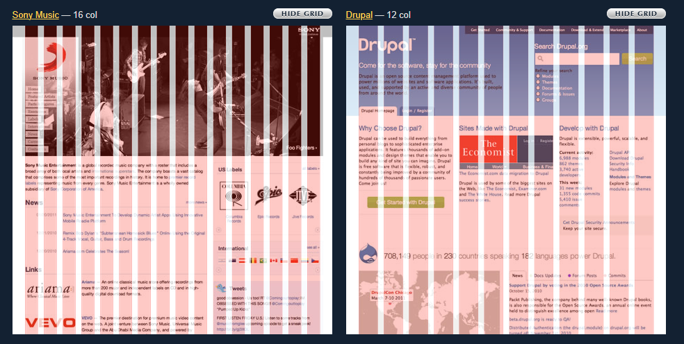
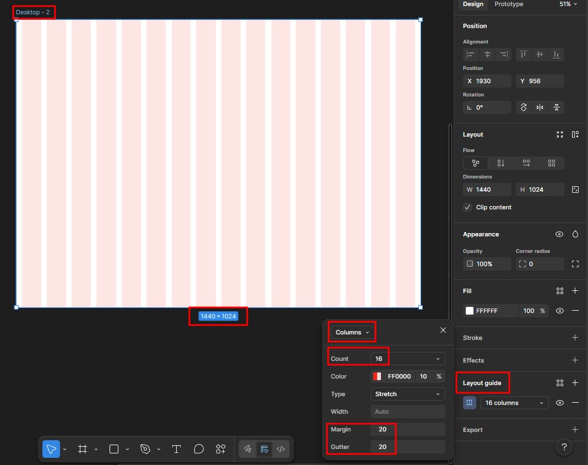
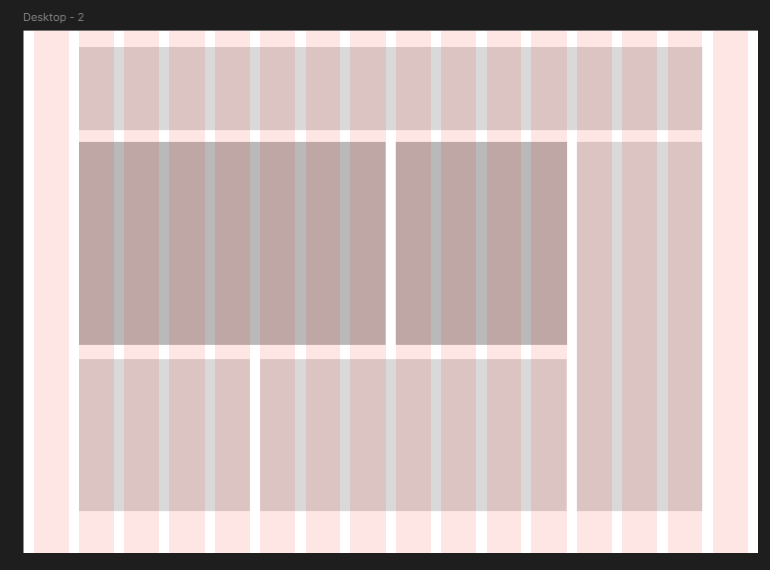
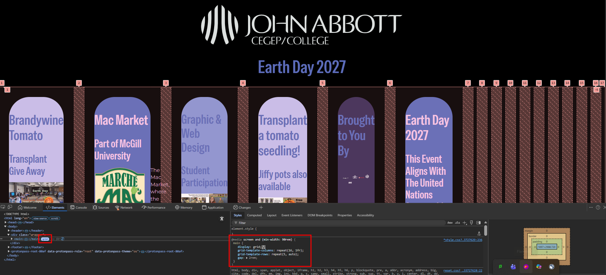

# Designing for desktop scale using CSS Grid

Currently we have:

- Mobile/default view up to 60rem (960px) wide.
- An intermediate view from 60rem to 90rem (1440px) wide.
- An empty media query that starts at 90rem.

## Objective

Use [CSS Grid](https://www.w3schools.com/css/css_grid.asp) to layout the information on the page in a series of rows and columns, similar to print page layout. As you can see in this [screencapture from 960.gs](https://www.960.gs), web site designs can be easily laid out in 12 or 16 columns.

### Step-by-Step

1. Everything we will write will be inside the 90rem media query. 

        @media screen and (min-width: 90rem) {

            /* write your css rules here */

        } /* closes media query */

2. Take the time to sketch your layout in terms of columns and rows so you have a visual to follow. You can use [Figma](https://www.figma.com/) for this. **Please create an account using your John Abbott College email address.**

What you need to find out: 

- How many columns wide will each box be?
- How many rows tall will each box be?
- How many rows will the entire page layout need?

3. Set your browser window width to **exactly 1440px** (90rem).

4. Define the grid in CSS

        main {
            display: grid;
            grid-template-columns: repeat(16, 1fr); /* 16 columns each equal to one fraction of the available space */
            grid-template-rows: repeat(4, minmax(40px, auto)); /* 4 rows for 4 sections */
            gap: 2rem;  /* both row and column gap */
        }

Now that we have defined the grid, we can see it in the browser. Note that the child elements of the main tag are each inserted into a column, in the natural flow order. The remaining columns are empty and at the end of the grid.

  

1. Note that the page layout will be all out of proportion until all the elements are placed on the grid. So we will temporarily hide all but one section to make it easier to work with:

        .gwd,
        .earthday,
        .logos,
        .giveaway,
        .transplant {
            display: none;
        }

6. Remove the margins and padding inherited from the tablet media query:
   
        section {
            padding-left: unset;
            padding-right: unset;
            margin: 0;
        } 

7. Place an element on the grid as row one

    To place an element on the grid you need to define the starting point: an intersection of a column and a row; and the end point: another intersection of a column and row.

        .macmarket {
            grid-column: 2/13;
            grid-row: 1/1;
            padding: 1rem 8.5% 2rem 8.5%;  /* note that percentages scale better when the window width changes */
            }

8. Remove .earthday from the hidden div list:

        .gwd,
        .logos,
        .giveaway,
        .transplant {
            display: none;
        }

9. Place .earthday on the grid as a right-hand side sidebar.

        .earthday {
             grid-column: 13/16;
             grid-row: 1/4;  /* full height on the grid */
         }

         .earthday .flex-container {
            grid-template-columns: 1fr;
            padding: 1rem;
            margin: 0 auto;
        }

 10. Remove .gwd from the hidden div list:

        .logos,
        .giveaway,
        .transplant {
           display: none;
        }       

10. Place .gwd on the grid as row 2      

        .gwd {
             grid-column: 2/8;
             grid-row: 2/2;
         }

        .gwd h1,
        .gwd h2,
        .gwd .two {
            padding: 1rem;
        }

12. Remove .transplant from the hidden div list:

        .logos,
        .giveaway {
            display: none;
        }

13. Place .transplant on the grid as the second column of row 2      

        .transplant {
            grid-column: 8/13;
            grid-row: 2/2;
            padding: 1rem;
         }

14. Remove .logos from the hidden div list:

        .giveaway {
            display: none;
        }
    
15. Place .logos on the grid as row 3

        .logos {
            grid-column: 2/13;
            grid-row: 3/3;
        }

16. Prepare the .logos for absolute positioning

        .logos {
            position: relative;
        }

15. Position the logos
        .logos .two li {
            position: absolute; /* all logos */
        }

        .logos .two li:nth-child(1) {
            top: 0%;
            left: 0%;
            width: 10rem;
        }

        .logos .two li:nth-child(2) {
             top: 0%;
            left: 0%;
            width: 10rem;
        }

        .logos .two li:nth-child(3) {
             top: 0%;
            left: 0%;
            width: 10rem;
        }

        .logos .two li:nth-child(4) {
            top: 0%;
            left: 0%;
            width: 10rem;
        }

        .logos .two li:nth-child(5) {
             top: 0%;
            left: 0%;
            width: 10rem;
        }
        
16. Delete the entire display none rule

        .giveaway {
            display: none;
        }
    
17. Place .giveaway on the grid as row 4

        .giveaway {
            grid-column: 2/13;
            grid-row: 4/4;
        }

18. Reduce the size of the UN icons as necessary

The CSS Grid will automatically expand to hold all the icons at their normal size. We can reduce their width to shorten the column so it matches the rest of the layout.

        .earthday .flex-container {
            grid-template-columns: 1fr;
            width: 60%;  /* reduce size of icons */
            margin: 0 auto;  /* center in column */
        }

19. Define proper row heights (optional)

Now that the elements are placed on the grid, you may want to assign specific row heights to avoid any overly tall/empty rows due to them being automatically expanded.

To do this, edit the main tag, and add a rem value for each row starting with the first.

        main {
            display: grid;
            grid-template-columns: repeat(16, 1fr);
            grid-template-rows: 33rem 50rem 20rem 30rem;
            gap: 2rem;
        }