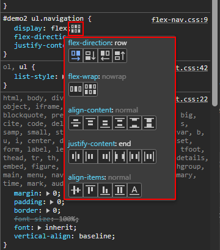

# Responsiveness Resources

## How to generate multiple columns

### Floats

Floats are the oldest, easiest and most troublesome way of making elements go side-by-side. 

[https://www.w3schools.com/Css/css_float.asp](https://www.w3schools.com/Css/css_float.asp)

#### Pros

        img {float: left;}

- Easy one liner
- Automatically tiles into rows and columns
- Useful for wrapping text around an image

#### Cons

- Takes items out of the text flow, breaking the box model
- Requires CSS hack (eg: clearfix) or "overflow: auto;" to make parent elements wrap around floated child elements
- [https://www.w3schools.com/Css/css_float_clear.asp](https://www.w3schools.com/Css/css_float_clear.asp)

        .clearfix::after {  /* apply class="clearfix" to parent html element */
            content: "";
            clear: both;
            display: table;
        }

        .parent-tag {
            overflow: auto;
        }

### Flexbox

CSS Flexible Box is an algorithm to layout web page elements **in a single dimension**, more often horizontally.

[https://www.w3schools.com/Css/css3_flexbox.asp](https://www.w3schools.com/Css/css3_flexbox.asp)

Play the [Flexbox Froggy game](https://flexboxfroggy.com/) to learn flexbox interactively.

#### Pros

- Responsive
- Multiple page layout options

#### Cons

- Requires multiple CSS properties to achieve an effect.
- Easy to understand, but not so easy to implement.

#### Tip

Use the visual flexbox editor in Google Chrome.

### CSS grid

CSS Grid is an algorithm to layout web page elements **in two dimensions**, horizontally and vertically.

[https://www.w3schools.com/Css/css_grid.asp](https://www.w3schools.com/Css/css_grid.asp)

Play the [CSS Grid Garden game](https://cssgridgarden.com/) to learn CSS Grid interactively.

#### Pros

- Lets designers use a grid layout similar to traditional graphic design but using modern web technologies.
- Supports laying out page elements both horizontally and vertically, at the same time.
- Simple grids (like aligning thumbnail images) are easy to do.

#### Cons

- Using grids for full page layout can get complicated. 

<blockquote>

### Note about nesting page layout techniques

You can place flexbox elements inside a grid layout, and vise-versa.

</blockquote>